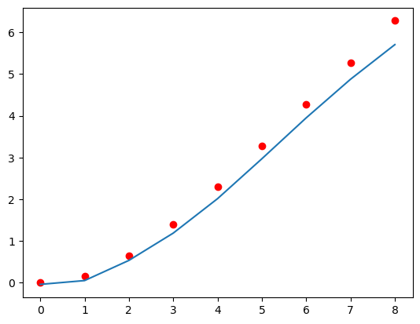
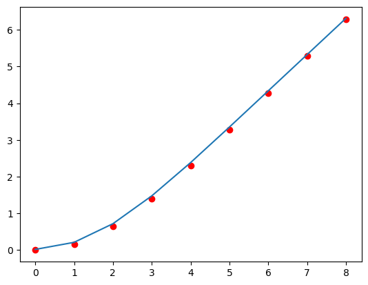

```python
import torch
import torch.nn as nn
import numpy as np
from torch.utils.data import TensorDataset
from torch.utils.data import DataLoader
import matplotlib.pyplot as plt
import warnings
import os
os.environ["KMP_DUPLICATE_LIB_OK"]="TRUE"
warnings.filterwarnings("ignore")
torch.set_printoptions(precision=20, threshold=None, edgeitems=None, linewidth=None, profile=None, sci_mode=None)

```


```python
x_train = torch.tensor([0.0,1.0,2.0,3.0,4.0,5.0,6.0,7.0,8.0], dtype=torch.float, requires_grad=True)
x_train=x_train.reshape(-1,1)
y_train_DrParand= torch.tensor([[0.000000000000,0.165571725847,0.650024370165,1.396808231342,2.305746419194,3.283273666139,4.279620923737,5.279238812489,6.279213433045]], dtype=torch.float,requires_grad=True)

y_train=y_train_DrParand
y_train=y_train.reshape(-1,1)
train_ds = TensorDataset(x_train, y_train)
train_dl = DataLoader(train_ds, batch_size=3, shuffle=True,drop_last=True)
```


```python
class CustomActivationLayer(nn.Module):
    def __init__(self, input_size, output_size,L):
        super(CustomActivationLayer, self).__init__()
        self.L=L

        # Ensure the output size matches the number of custom functions
        assert output_size == 9, "This example requires exactly 3 output nodes."

    def forward(self, x):
        # Get the linear output
        linear_out = x
        L=self.L
        activated_out = torch.stack([
            linear_out[:,0]*0+1.0,
            (linear_out[:,1]-L)/(linear_out[:,1]+L),
            1.5*((linear_out[:,2]-L)/(linear_out[:,2]+L))**2-1.5,
            2.5*((linear_out[:,3]-L)/(linear_out[:,3]+L))**3-1.5*((linear_out[:,3]-L)/(linear_out[:,3]+L)),
            4.375*((linear_out[:,4]-L)/(linear_out[:,4]+L))**4-3.75*((linear_out[:,4]-L)/(linear_out[:,4]+L))**2+0.375,
            7.875*((linear_out[:,5]-L)/(linear_out[:,5]+L))**5-8.75*((linear_out[:,5]-L)/(linear_out[:,5]+L))**3+1.875**((linear_out[:,5]-L)/(linear_out[:,5]+L)),
            14.4375*((linear_out[:,6]-L)/(linear_out[:,6]+L))**6-19.6875*((linear_out[:,6]-L)/(linear_out[:,6]+L))**4 +6.5625*((linear_out[:,6]-L)/(linear_out[:,6]+L))**2 - 0.3125,
            26.8125*((linear_out[:,7]-L)/(linear_out[:,7]+L))**7-43.3125*((linear_out[:,7]-L)/(linear_out[:,7]+L))**5 +19.6875*((linear_out[:,7]-L)/(linear_out[:,7]+L))**3 -2.1875*((linear_out[:,7]-L)/(linear_out[:,7]+L)),
            50.2734375*((linear_out[:,8]-L)/(linear_out[:,8]+L))**8-93.84375*((linear_out[:,8]-L)/(linear_out[:,8]+L))**6+54.140625*((linear_out[:,8]-L)/(linear_out[:,8]+L))**4-9.84375*((linear_out[:,8]-L)/(linear_out[:,8]+L))**2 +0.2734375,
            #94.9609375*((linear_out[:,9]-L)/(linear_out[:,9]+L))**9-201.09375*((linear_out[:,9]-L)/(linear_out[:,9]+L))**7+140.765625*((linear_out[:,9]-L)/(linear_out[:,9]+L))**5-36.09375*((linear_out[:,9]-L)/(linear_out[:,9]+L))**3+2.4609375*((linear_out[:,9]-L)/(linear_out[:,9]+L)),
            #180.42578125*((linear_out[:,10]-L)/(linear_out[:,10]+L))**10-427.32421875*((linear_out[:,10]-L)/(linear_out[:,10]+L))**8+351.9140625*((linear_out[:,10]-L)/(linear_out[:,10]+L))**6-117.3046875*((linear_out[:,10]-L)/(linear_out[:,10]+L))**4+13.53515625*((linear_out[:,10]-L)/(linear_out[:,10]+L))**2-0.2460937500000
        ], dim=1)
        return activated_out

```


```python
class MyModule(nn.Module):
    def __init__(self):
        super().__init__()
        self.l1 = nn.Linear(1, 9, bias=False)
        self.a1 = nn.Tanh()
        self.l2 = nn.Linear(9, 9, bias=False)
        self.a2 = nn.Tanh()
        self.a3 = CustomActivationLayer(9, 9, 2.0)
        self.l3 = nn.Linear(9, 1, bias=False)

    def forward(self, x):
        x=self.l1(x)
        x=self.a1(x)
        x=self.l2(x)
        x=self.a2(x)
        x=self.a3(x)
        x=self.l3(x)
        return x+1.0
model=MyModule()


```


```python
num_epochs=20000
loss_fn = nn.MSELoss(reduction='mean')
optimizer = torch.optim.SGD(model.parameters(), lr=0.001)

for epoch in range(num_epochs):
    mysum=0.0
    for x_batch, y_batch in train_dl:
        pred = model(x_batch)
        loss = loss_fn(pred, y_batch)
        loss.backward()
        nn.utils.clip_grad_value_(model.parameters(), clip_value=1.0)
        optimizer.step()
        optimizer.zero_grad()
        mysum=mysum+loss.item()
    if epoch % 1000 ==0:
        print(f'Epoch {epoch}  Loss {mysum/y_train.shape[0]:.20f}')
    if mysum/y_train.shape[0]< 0.0005:
        break

```

    Epoch 0  Loss 2712.66655815972217169474
    Epoch 1000  Loss 0.21270329753557840058
    Epoch 2000  Loss 0.04233723175194528676
    Epoch 3000  Loss 0.07236784613794750021
    Epoch 4000  Loss 0.07107575651672151662
    Epoch 5000  Loss 0.09654292774697144364
    Epoch 6000  Loss 0.04409087200959523750
    Epoch 7000  Loss 0.17033762919406095215
    Epoch 8000  Loss 0.05159736528164810682
    Epoch 9000  Loss 0.01504682666725582624
    Epoch 10000  Loss 0.02381299560268719875
    Epoch 11000  Loss 0.01343442178848716986
    Epoch 12000  Loss 0.02904755166835255170
    Epoch 13000  Loss 0.03097505939917431783
    Epoch 14000  Loss 0.07860753022962146952
    Epoch 15000  Loss 0.07531202708681423996
    Epoch 16000  Loss 0.14321439133750069050
    Epoch 17000  Loss 0.06244022233618630457
    Epoch 18000  Loss 0.04770495825343661761
    Epoch 19000  Loss 0.04560981856452094030


```python
y_pred = model(x_train)
MAE=torch.abs(y_train-y_pred).mean()
print('Mean Absolute Error',MAE.item())
y_pred = y_pred.detach().numpy()
plt.plot(x_train.detach().numpy(), y_pred)
plt.scatter(x_train.detach().numpy(),y_train.detach().numpy(),c='red')
plt.show()

```

    Mean Absolute Error 0.2648076117038727


    

    


```python
x=torch.linspace(0,10,100,requires_grad=True)
x=x.reshape(-1,1)
```


```python
model=MyModule()

```


```python
def dy_dx(y, x):
    return torch.autograd.grad(
        y, x, grad_outputs=torch.ones_like(y), create_graph=True,allow_unused=True
    )[0]

```


```python
optimizer = torch.optim.Adam(model.parameters(), lr=.01)

```


```python
losses=[]
n_epochs=20000

for i in range(n_epochs):
    y=model(x)
    y_p = dy_dx(y, x)
    y_pp = dy_dx(y_p, x)
    y_ppp = dy_dx(y_pp, x)

    residential = y_ppp+0.5*y*y_pp
    initial1 = y[0] - 0
    initial2 = y_p[0] - 0
    initial3 = y_p[-1]-.99

    loss = 10*initial3**2+1000*(residential**2).mean() + initial1**2 + initial2**2
    if loss.item() < 0.010:
        break

    optimizer.zero_grad()
    loss.backward()
    optimizer.step()

    losses.append(loss.detach().numpy())

    if i % 1000 == 0:
        print('Epoch=',i,' ,Loss=',loss.detach().numpy()[0])


```

    Epoch= 0  ,Loss= 12.751281
    Epoch= 1000  ,Loss= 11.318814
    Epoch= 2000  ,Loss= 10.398304
    Epoch= 3000  ,Loss= 9.985626
    Epoch= 4000  ,Loss= 9.863499
    Epoch= 5000  ,Loss= 9.833488
    Epoch= 6000  ,Loss= 9.820895
    Epoch= 7000  ,Loss= 9.813649
    Epoch= 8000  ,Loss= 9.796843
    Epoch= 9000  ,Loss= 5.4932775
    Epoch= 10000  ,Loss= 8.120285
    Epoch= 11000  ,Loss= 0.11156477
    Epoch= 12000  ,Loss= 0.03198232
    Epoch= 13000  ,Loss= 0.020248733
    Epoch= 14000  ,Loss= 0.100077234
    Epoch= 15000  ,Loss= 0.013107701


```python
print(y_p[-1])

```

    tensor([0.98747539520263671875], grad_fn=<SelectBackward0>)


```python
def eval_residual(x):
    y=model(x)
    y_p = dy_dx(y, x)
    y_pp = dy_dx(y_p, x)
    y_ppp = dy_dx(y_pp, x)

    print('y_pp(0)=',y_pp[0].item())
    # modify the equation to match the one you sent
    residential = y_ppp+0.5*y*y_pp
    initial1 = y[0] - 1
    initial2 = y_p[0] - 0
    initial3 = y_p[-1]-.990
    return (residential**2).mean() + initial1 + initial2+ initial3
res=eval_residual(x)
y_pred=model(x)

print('Mean Residual=',res.item())

```

    y_pp(0)= 0.3327368199825287
    Mean Residual= -0.9553216099739075


```python
x= torch.tensor([0.0,1.0,2.0,3.0,4.0,5.0,6.0,7.0,8.0], dtype=torch.float, requires_grad=True)
x=x.reshape(-1,1)
y_pred = model(x)
MAE=torch.abs(y_train-y_pred).mean()
print('Mean Absolute Error Between Dr Parand results and the presented model:',MAE.item())
y_pred = y_pred.detach().numpy()
plt.plot(x_train.detach().numpy(), y_pred)
plt.scatter(x_train.detach().numpy(),y_train.detach().numpy(),c='red')
plt.show()

```

    Mean Absolute Error Between Dr Parand results and the presented model: 0.0549532026052475


    

    


```python

```
